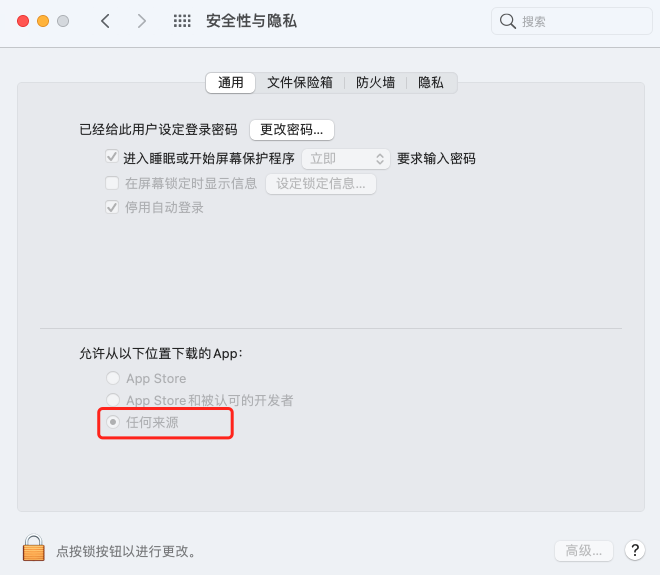
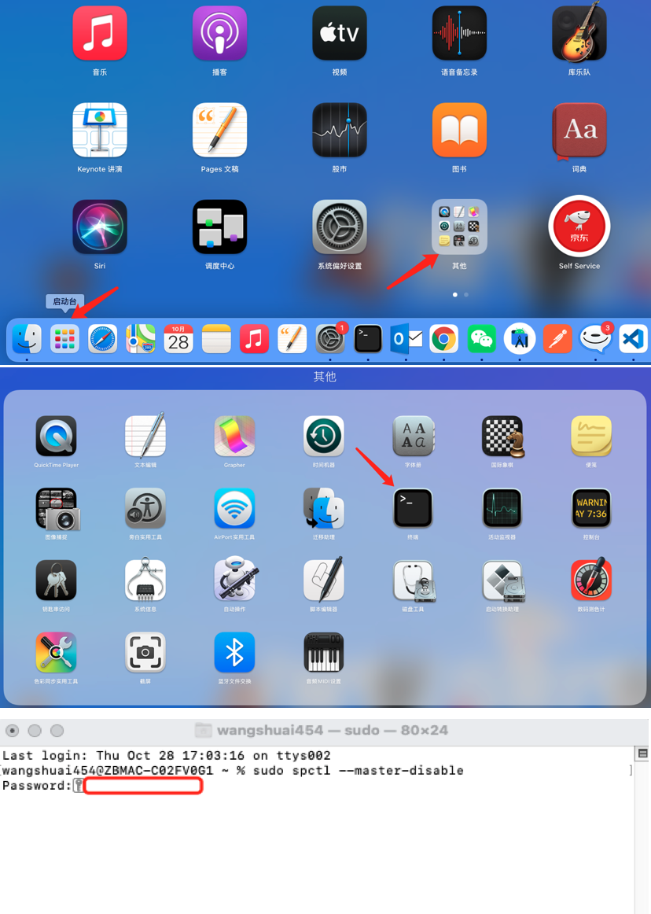

# 安装说明

## Windows安装
跳转至<a href="/cherry/guide/introduce/download.html">下载</a>页面，点击`WIN下载`按钮，等待下载完成后，逐一点击下一步直至安装完成。
## Mac安装
跳转至<a href="/cherry/guide/introduce/download.html">下载</a>页面，点击`MAC下载`按钮，等待下载完成后，拖动YinTao-drive.app进Applications即可。
### 安装成功校验
- 打开桌面YinTao应用，然后打开浏览器，地址栏输入：`http://localhost:8777/ping`
- 返回`{"ok":1}`即代表安装成功

### 安装问题说明

  

- 无法打开软件，如上图，请在系统偏好设置->安全性与隐私页面，勾选任何来源，见下图。

  

- 如上图设置页面，没有任何来源选项，请打开终端(启动器->其他->终端)
- 输入sudo spctl --master-disable
- 根据提示输入电脑开机密码，再次打开软件，弹窗点击打开即可

  

  使用过程中如果你有任何的意见或者问题，欢迎加入咚咚交流群(1021914530)