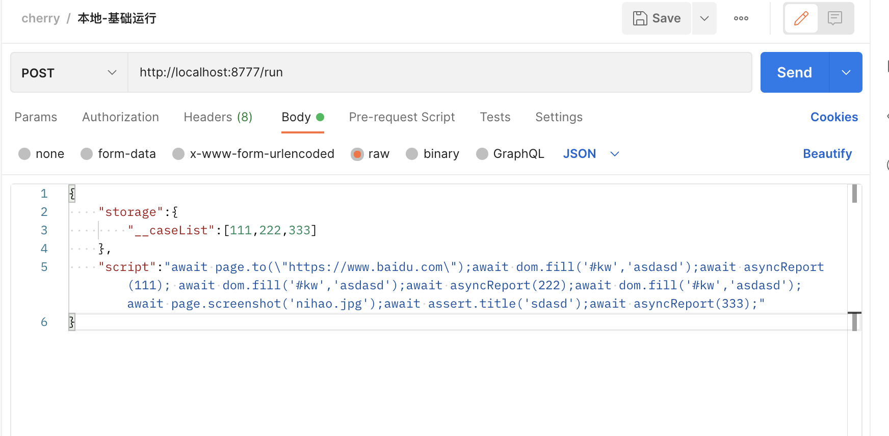

# 使用说明

## Postman
### 录制脚本
- 打开postman，创建post请求，地址栏输入：`http://localhost:8777/live`
- Body选择raw，格式选择JSON，内容输入如下
```js
{
  "url": "https://element.eleme.cn/#/zh-CN/component/cascader",
  "storage": {
    "id":123
  }
}
```
- postman完整录制请求截图如下
<p style="text-align: center;">
  
</p>
- 点击上图的Send按钮，打开chrome浏览器后，即可进行脚本的录制工作。
- 录制完成后，生成的脚步代码在Response的Body内，见上图。
### 执行脚本
- 打开postman，创建post请求，地址栏输入：`http://localhost:8777/run`
- Body选择raw，格式选择JSON，内容输入如下
```js
{
    "script": "await page.create(`http://www.baidu.com`)\nawait page.change(0)\nawait dom.click(`#kw`)\nawait dom.set(`京东`,`#kw`)\nawait keyboard.press(`Enter`)\nawait dom.click(`(//*[string()='京东JD.COM官网 多快好省 只为品质生活'])[1]`)\nawait page.change(1)\n",
    "storage": "123",
}
```
- postman完整回放脚本截图如下
<p style="text-align: center;">
  
</p>
- 点击上图的Send按钮，自动打开浏览器回放脚本。

  使用过程中如果你有任何的意见或者问题，欢迎反馈。