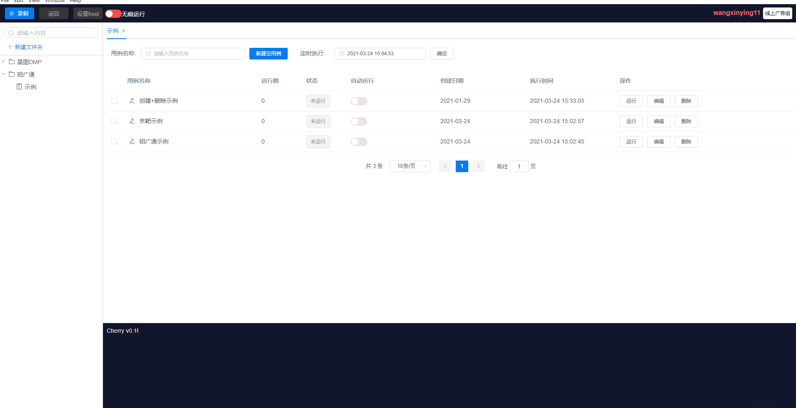

# 京靶创建计划并自动删除计划数据
  
   请求示例:
```
  //打开京靶平台
  await openBrowser('http://jdat.jd.com/#/')
  var keyName = "创建+删除"
  //新建计划
  await getDom('//body/div[1]/div[2]/div[1]/div[1]/div[1]/div[1]/div[2]/div[1]/div[1]/div[1]/div[1]'); await click()
  await getDom('//*[@id="app"]/section[1]/section[1]/div[1]/div[3]/div[1]/div[3]/table[1]/tbody[1]/tr[4]/td[1]/div[1]'); await click()
  await getDom('//*[@id="app"]/section[1]/section[1]/div[1]/div[4]/div[3]/button[2]'); await click()
  await getDom('//body/div[4]/div[1]/div[2]/form[1]/div[2]/div[1]/div[1]/input[1]'); await click()
  await getDom('//body/div[4]/div[1]/div[2]/form[1]/div[2]/div[1]/div[1]/input[1]'); await set(keyName);
  await getDom('//body/div[4]/div[1]/div[2]/form[1]/div[3]/div[1]/div[1]/input[1]'); await click()
  await getDom('//body/div[6]/div[1]/div[1]/div[1]/table[1]/tbody[1]/tr[5]/td[4]/div[1]/span[1]'); await click()
  await getDom('//body/div[6]/div[1]/div[1]/div[2]/table[1]/tbody[1]/tr[6]/td[6]/div[1]/span[1]'); await click()
  await getDom('//body/div[4]/div[1]/div[2]/form[1]/div[4]/div[1]/div[1]/input[1]'); await click()
  await getDom('//body/div[4]/div[1]/div[2]/form[1]/div[4]/div[1]/div[1]/input[1]'); await set("100");
  await getDom('//body/div[4]/div[1]/div[3]/span[1]/button[2]/span[1]'); await click()
  //等待返回计划列表
  await sleep(3000)
  //根据关键字找到需要删除的计划并删除
  await lineKeyOperation(keyName,'el-table__row','删除')
  await getDom('.el-button--default:nth-child(2) > span'); await click())
```

# show
<p style="text-align: center;">
  
</p>