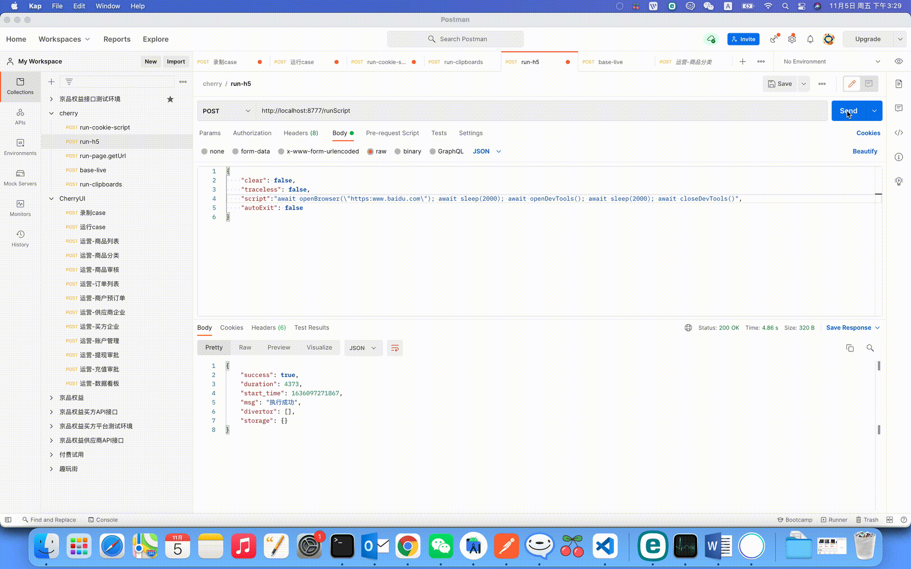

# 打开/关闭浏览器调试模式
cherry引擎支持代码实现打开/关闭浏览器调试模式的功能

请求示例:
```
  await openBrowser(`https:www.baidu.com`)
  await sleep(2000);
  // 打开浏览器调试模式
  await openDevTools();
  await sleep(2000);
  // 关闭浏览器调试模式
  await closeDevTools();
```

# show
<p style="text-align: center;">
  
</p>