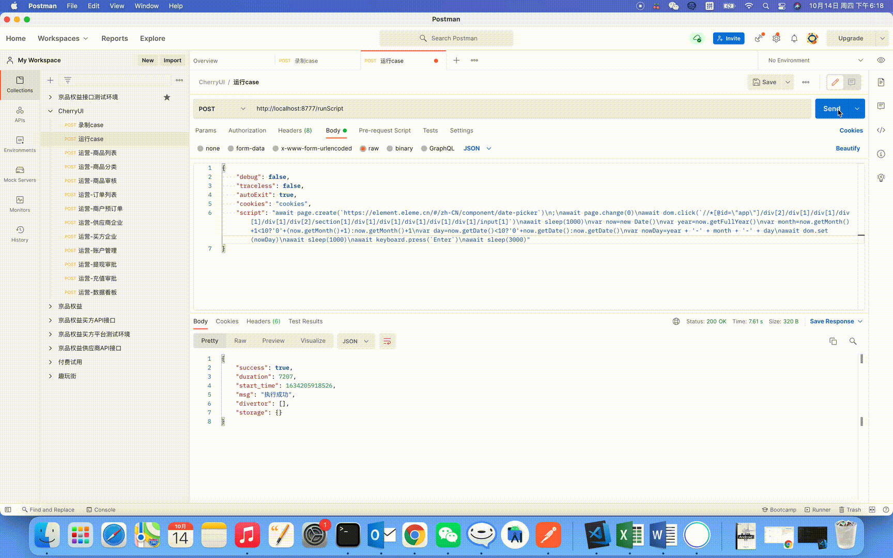

# Element日期组件获取当前日期
  cherry 引擎支持插入js代码运行，例如在选择日期控件时，编写获取当前日期js代码，即可解决因选择固定日期导致用例执行失败的情况。
   
   请求示例:
```
  //打开Element日期组件
  await page.create(`https://element.eleme.cn/#/zh-CN/component/date-picker`)
  await page.change(0)
  await dom.click(`//*[@id=\"app\"]/div[2]/div[1]/div[1]/div[1]/div[1]/div[2]/section[1]/div[1]/div[1]/div[1]/div[1]/div[1]/input[1]`)
  await sleep(1000)
  //js获取当前日期
  var now = new Date()
  var year = now.getFullYear()
  var month = now.getMonth() + 1 < 10 ? '0' + (now.getMonth() + 1) : now.getMonth()+1
  var day = now.getDate() < 10 ? '0' + now.getDate() : now.getDate()
  var nowDay = year + '-' + month + '-' + day
  await dom.set(nowDay)
  await sleep(1000)
  await keyboard.press(`Enter`)
  await sleep(3000)
```

# show
<p style="text-align: center;">
  
</p>