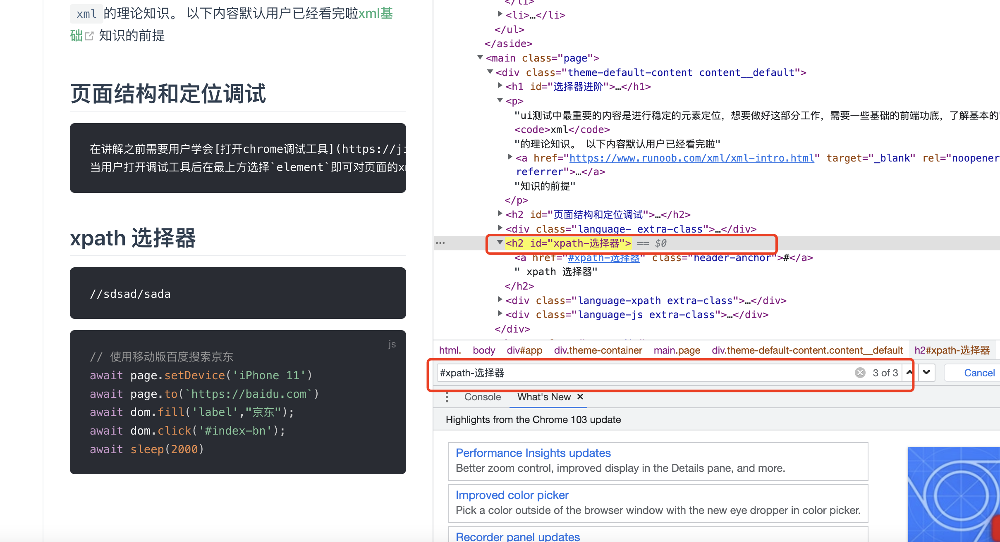

# 选择器进阶

ui测试中最重要的内容是进行稳定的元素定位，想要做好这部分工作，需要一些基础的前端功底，了解基本的`xml`的理论知识。
以下内容默认用户已经看完啦[xml基础](https://www.runoob.com/xml/xml-intro.html)知识的前提


## 页面结构和定位调试
在讲解之前需要用户学会[打开chrome调试工具](https://jingyan.baidu.com/article/ab69b270835e026da6189f31.html),
当用户打开调试工具后在最上方选择`element`即可对页面的xml层级元素进行调试啦。

在调试工具页面中按下`ctrl + f` 将会出现一个输入框，在输入框输入标准选择器`(xpath or css selector)`，如果有匹配元素将会高亮显示，
通过查看高亮元素即可，确定定位方式是否准确。

<p style="text-align: center;">
  
</p>


## xpath 选择器

很多人对xpath可能并不陌生，但大多只了解xapth的基础定位方式,例如全路径定位`/html/body/div/p/span`
其实xpath支持很多定位方式，模糊以及动态定位，且编写，测试相对容易,因此`重点推荐使用`。

以下理解需要[xpath基础](https://www.runoob.com/xpath/xpath-syntax.html)，不了解的可以先行学习

``` shell

//label[text()="活动名称"]    # 根据文本内容匹配元素

//label[string()="活动名称"]    # 根据包含内容匹配子元素- 容易匹配多个

//div[contains(@class,"a")]  # 模糊匹配包含class的元素

//div[contains(@class,"a") or contains(@class,"b")  # 模糊匹配 or 范围元素
//div[contains(@class,"a") and contains(@class,"b")  # 模糊匹配 and 范围元素

//label[@title="活动期限："]/parent  # 根据子元素匹配父元素

//label[@title="活动期限："]/parent::*/parent::*//input  # 根据元素属性相对路径匹配父子元素

(//label[@title="活动期限："]/parent::*/parent::*//input)[1]  # 根据匹配重复元素下标来定位单个元素

```

`xpath`使用方式众多，以上不过是对常用的一些举例， 指令函数之间支持组合使用, 更多使用方式可以在学习中理解。


## 其他定位方式

通常情况xapth足以满足所有业务场景使用，无需使用其他定位方式。
但是如果对代码有洁癖的同学，也提供其他的定位方式作为补充

详情见 [selectors定位器介绍](https://playwright.dev/docs/selectors)

这些定位器不一定是浏览器支持的标准，例如`text=Log in` 这类文本定位器，
是通过`xpath`或`selector`等标准定位器，
解析转化而来，以达到简化代码量，降低理解门槛等目的。 

因此这类定位方式并不支持在浏览器中调试。


## 原生定位方式

除了以上定位方式外，原生定位方式通常使用较少，但是这类方式更加灵活，同时需要编写人员具有一定js基础

可以通过以下方式来使用原生定位
```js
const id =  await execJavaScript(`
    document.getElementById("kd").id
`)

// document.getElementsByTagName  通过标签名获取元素
// document.getElementsByClassName 通过元素属性获取
// document.querySelector();  通过selector 选择器获取元素
// document.getElementsByName  通过元素名称获取
```

想了解全部的原生定位方式可以通过查看[mdn document](https://developer.mozilla.org/zh-CN/docs/Web/API/Document#getElementsByClassName) 来学习